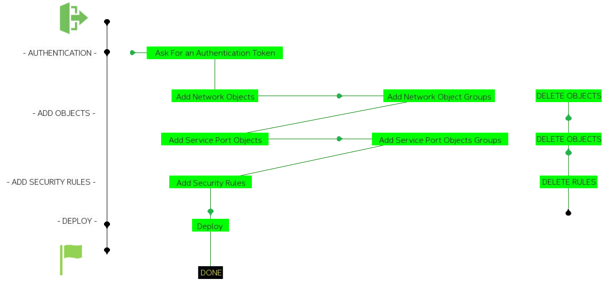

# Add Security Rules into FirePOWER FDM Managed Device

## Quick start for creating objects and Security Rules into FDM

The goal of this project it to give some ready to use scripts for basic interactions with FDM managed FTD devices for any version starting from 6.3.

What we want to to here is to ingest Objects and rules into the device from flat csv files. That means that the only effort we have to do is to create these CSV files.

## Installation

Installing these script is pretty straight forward . You can just copy / and paste them into you python environment but a good practice is to run them into a python virtual environment.

### Install a Python virtual environment

	For Linux/Mac 

	python3 -m venv venv
	source bin activate

	For Windows 

	virtualenv env 
	\env\Scripts\activate.bat 
	
	or
	
	python -m venv venv 
	venv\Scripts\activate

### git clone the scripts

	git clone https://github.com/pcardotatgit/FDM_Add_Security_Rules.git
	cd FDM_Add_Security_Rules/
	
## Workflow

## Running the scripts

**1 - First** of all you have to enter the device access credentials into the **profile_ftd.yml** 

- **profile_ftd.yml** : define FTD device IP address and **username / password** needed to connect to it, and the FTD sofware version ( version = 2 for FTD 6.3,  version = 3 for 6.4 , version = 4 for 6.5, version = 5 for 7.0, version = 6 for 7.2, the **0_fdm_generate_token.py** script will display you the valid API versions to use ).  This configuration file will be loaded by all other scripts.

**2 - Second** you have to run the **0_fdm_generate_token.py** script. This in order to avoid in every script to ask for a new authentication token, the **0_fdm_generate_token.py** asks for a token and stores it into a text file named **./temp/token.txt**.  

The generated token will be valid during 30 minutes and all python scripts will firt read this **token.txt** file for retrieving the token. If the token expired, python scripts will automatically ask for a new token.

So running **0_fdm_generate_token.py** is supposed to be the first operation to do, for geeting an authentication token, and test admin access to the FTD device.

## Here under the list of all scripts and their purposes

- **0_fdm_generate_token.py** : Test connection to FTD and Generate an Authentication Token. Store Token it into the **./temp/token.txt** file
- **1_fdm_get_networks.py**: Display all existing network objects and objects groups. Save them into a text file in the **./temp/network_objects.txt** folder
- **2_fdm_add_network_objects.py** : Add new network objects to FTD Device from the **./objects_csv_files/network_objects.csv** file
- **3_fdm_add_network_object_group.py**: Add new network object groups to FTD Device from the **./objects_csv_files/network_object_groups.csv**  file
- **4_fdm_delete_networks.py** : Delete all network object groups and network objects from the **./temp/network_objects.txt** file
- **5_fdm_get_services.py** :  Display all service objects and save them into a text file in the **./temp/service_objects.txt** folder
- **6_fdm_add_service_objects.py** : Add new service objects into to FTD Device from the **./objects_csv_files/service_objects.csv** file
- **7_fdm_add_service_object_group.py**: Add new service objects to FTD Device from **./objects_csv_files/service_object_groups.csv** file
- **8_fdm_delete_services.py**: Delete all service objects from the **./temp/service_objects.txt** file
- **9_fdm_get_access_policy.py**: Display all access policies and save into the **./temp/access_policies.txt** file 
- **10_fdm_add_access_policy.py**: Add new Access Policies to FTD device from the **./objects_csv_files/security_access_rules.csv**  file
- **11_fdm_delete_access_policies.py**: Delete all access Policies from the **./temp/access_policies.txt** file
- **100_fdm_deploy.py**: Deploy last changes to FTD device

Every changes can be verified from FDM GUI